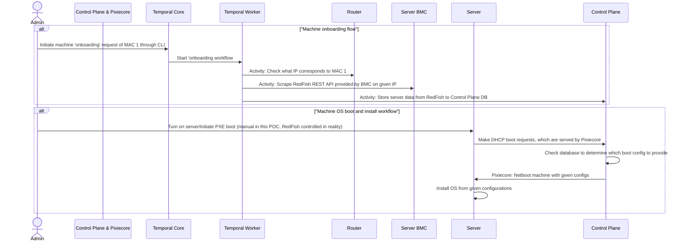

# 'Metal Control Plane' POC mockup with Temporal

Basic implementation of [Railway's](https://railway.app) ["Zero-Touch Bare Metal at Scale"](https://blog.railway.com/p/data-center-build-part-two) article using Go with Temporal for workflow orchestration, Pixiecore for booting, and UniFi for basic network queries.

'Onboard' a bare-metal server by providing its [BMC](https://www.supermicro.com/en/glossary/baseboard-management-controller) MAC address, and the application finds the machine, scrapes its [RedFish API](https://www.dmtf.org/standards/redfish) for hardware details, and persists them in a DB. When that bare-metal server is then started up, it is PXE-booted straight to a Linux installer specified by this application based on the configuration of that server.

## Sequence Diagram

The 'bare metal' server in this case can be two separate machines (e.g., VMs) for the purposes of simulating a real server with a BMC.



## Deploy locally

- Make sure your local machine firewall allows UDP traffic on 67,68,69 as these are used by Pixiecore
- Make sure your local router is not serving PXE boot requests, to avoid interfering with the boot process

## Workflow #1 - Onboarding

1. Run RedFish emulator on your 'BMC' host:

    ```bash
    # in case you want to build the container, in case your host is e.g. arm64 like a Raspberry Pi
    podman build -t dmtf/redfish-interface-emulator:latest https://github.com/DMTF/Redfish-Interface-Emulator.git

    podman run --rm --detach --name redfish-emulator -p 5000:5000 dmtf/redfish-interface-emulator:latest
    ```

1. Get the MAC address of the BMC host
1. Configure `.env` with credentials to UniFi router
1. `make containers` - spins up Temporal backend and pixiecore
1. `make worker` - run a Temporal worker
1. `make migrate` - prepare control plane DB
1. Initiate onboarding with `go run main.go onboard $MAC` - with the MAC of your 'BMC' host.

This 'onboards' the new machine to the control plane database, with a given hardware config and MAC addresses.

## Workflow #2 - Provisioning/netbooting

1. Configure `.env.` and run `source .env` in all terminals used to run these commands
1. `make containers` - make sure all containers are up
1. `make control-plane` - run the control plane API
1. Create a VM, and give it a MAC address of `12:44:6A:3B:04:11` - this is one of the defaults used in the RedFish emulator.
1. Trigger boot - power on that VM, and it will boot into a CentOS installer, as defined by the selection logic [here](./internal/pixieapi/api.go) to choose the server type, and the [configurations here](./internal/pixieapi/servertype_config.go) to specify boot options.

The VM will talk to Pixiecore, which in turn asks the control plane which configs to give to the newly booting machine with MAC `12:44:6A:3B:04:11`. The control plane DB has this MAC, since you onboarded the server whose RedFish API returned this MAC address.
